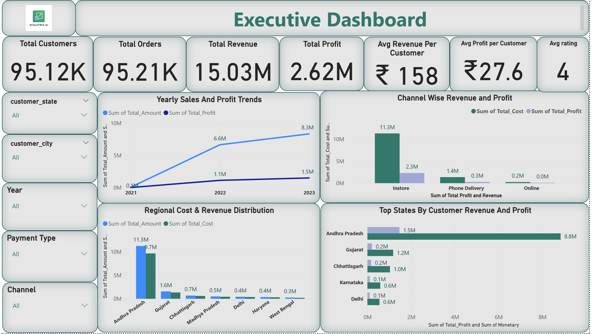
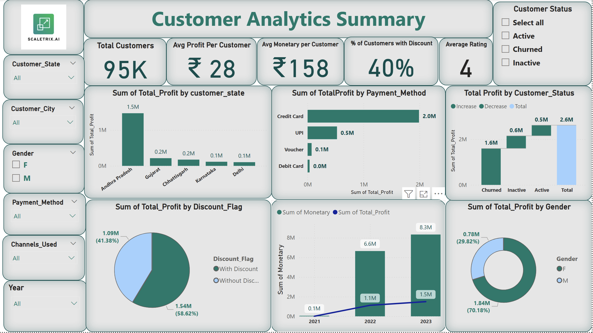
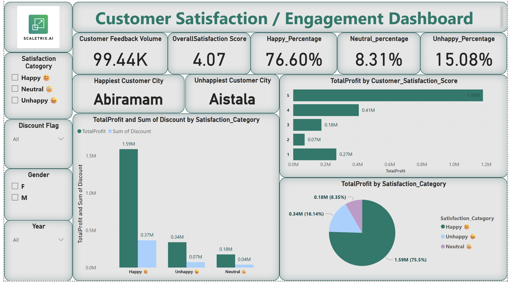
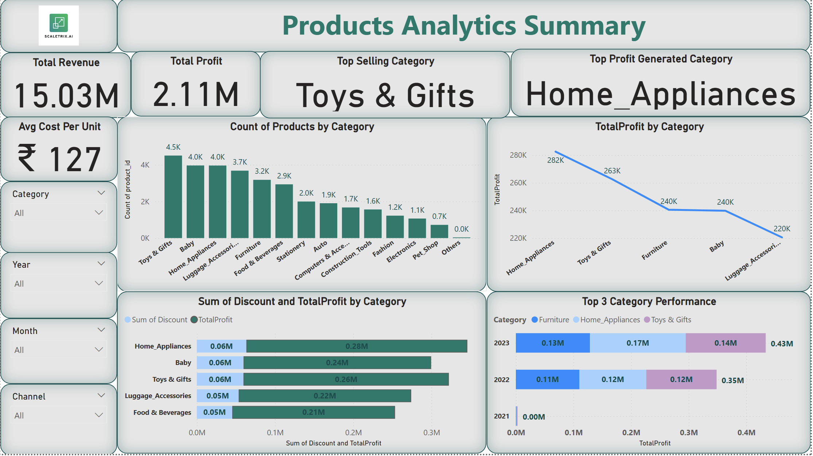
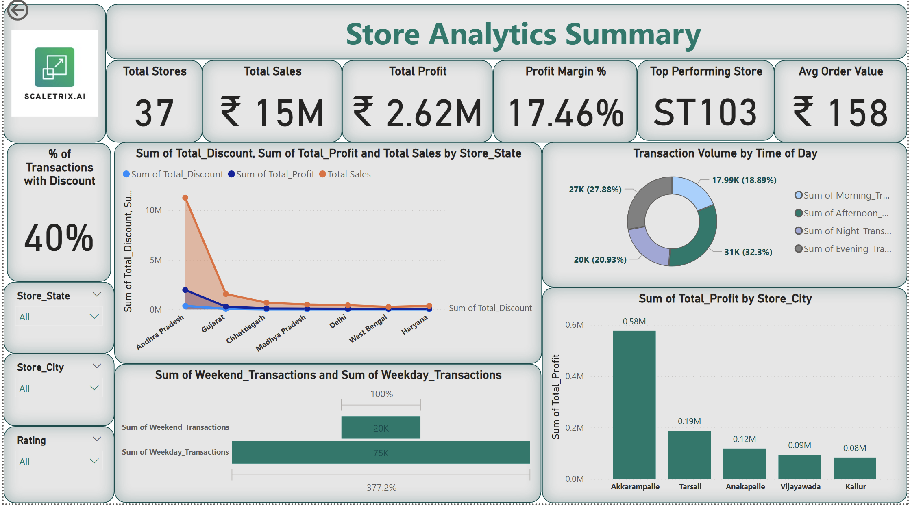

# 🏬 Retail Stores Performance & Data Quality Analysis

> A real-world retail analytics project focused on fixing data quality issues and building executive-ready dashboards for business decision-making.

## 📌 Project Overview
This project focuses on auditing, cleaning, and analyzing data from a large
multi-channel retail company operating across India.

The objective was to ensure **data integrity**, resolve **quality issues**,
and build **Customer360, Order360, and Store360** analytical views to support
business decision-making and dashboard reporting.

---

## 🧠 Business Context
- Sales Channels: In-Store, Phone Delivery, Online
- Time Period: Feb 2020 – Oct 2023
- Scale:
  - 95K+ customers
  - 37 stores
  - 20 states
  - 95K+ valid orders after cleaning

---

## ❓ Key Business Problems Addressed
- Duplicate and inconsistent order records
- Orphan records in payments and ratings tables
- Referential integrity violations across tables
- Date format inconsistencies affecting time analysis
- Revenue vs payment mismatches impacting financial accuracy

---

## 🛠 Tools & Technologies
- **SQL** – Data cleaning, validation, joins, window functions, pivots
- **Power BI** – Interactive dashboards (executive,customer,store,product,customer_satisfaction)
- **Excel** – Initial inspection & validation
- **PPT** – Business reporting & stakeholder presentation

---

## 🧹 Data Cleaning & Validation Highlights
- Removed **7,000+ duplicate order records**
- Fixed **orphan payments & ratings** with no matching orders
- Standardized date-time formats
- Enforced **foreign key integrity** across all tables
- Built audit tables for mismatch tracking
- Final dataset achieved **~94% order-payment consistency**

---

## 📊 Power BI Dashboards

### 🔹 Executive Overview
High-level snapshot of business performance covering revenue, profit, customer base,
and year-over-year growth trends for leadership decision-making.

---

### 🔹 Customer Analytics
Analyzes customer distribution, purchase behavior, revenue contribution,
and segmentation across geography and demographics.

---

### 🔹 Customer Satisfaction
Focuses on customer experience using ratings, feedback trends,
and satisfaction impact on profitability.

---

### 🔹 Product Analytics
Evaluates product category performance, sales contribution,
discount impact, and profit margins.

---

### 🔹 Store Analytics
Compares store-level performance across regions,
highlighting top and low-performing stores and time-based trends.

---

## 📁 Project Structure
- `data/` → Raw and cleaned datasets  
- `sql/` → Data cleaning, validation & audit queries  
- `visuals/powerbi/` → Power BI files  
- `visuals/report_presentation/` → Final business presentation  
- `assets/` → Logos and branding files  

---

## 📘 Detailed Documentation
Full step-by-step explanation, SQL logic, findings, and business insights:

---

## 🚀 Key Business Insights
- In-store sales contribute **~88% of total revenue**
- 2023 generated **55% of total revenue** across 3.5 years
- Average customer rating: **4.0**
- Discount customers generate **higher profit per customer**
- Customer base is wide but **repeat purchases are low**

---

## 🧠 What I Learned
- How to audit large relational datasets
- Designing data-quality checks for real businesses
- Translating raw data into executive dashboards
- Importance of data integrity before visualization

---
📘 Detailed case study (Notion): Coming soon

**Author:** Abhinandh O  
